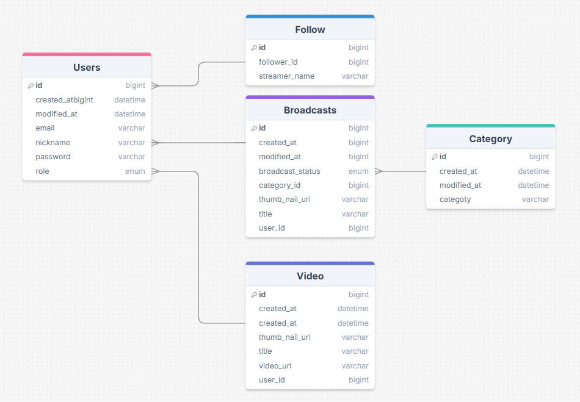
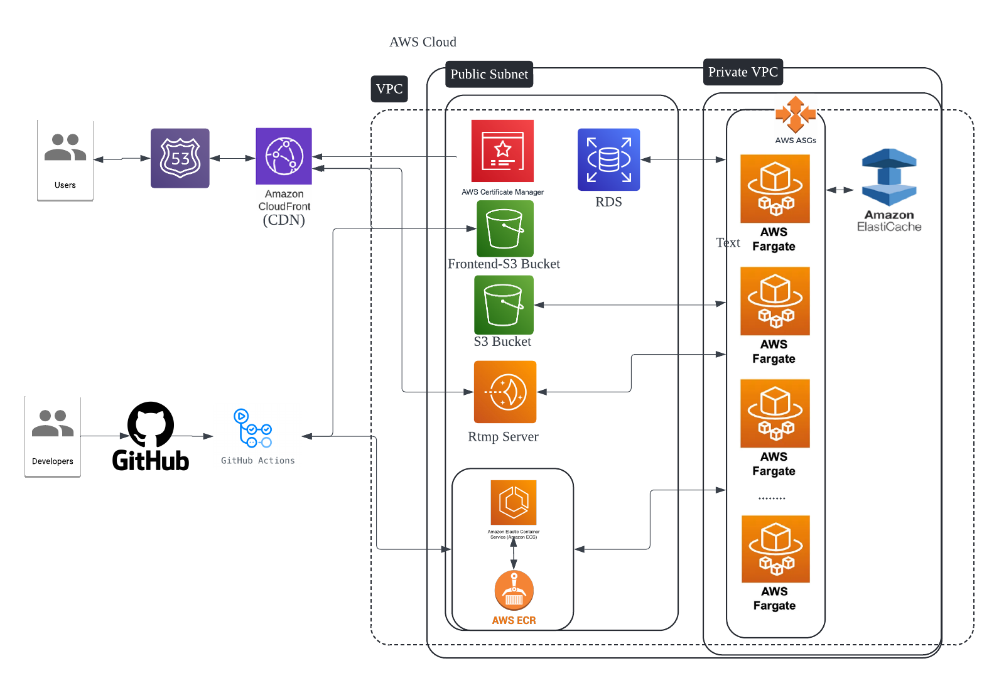

# Notion : [Gametric Notion](https://www.notion.so/Gametric-1c74f54d931480fbb042e9d97eb177ef)
Gametric is an all-in-one web platform that empowers creators to stream live via RTMP, upload and share videos, and interact with audiences in real time.
It combines live broadcasting, VOD features, a social follow system, and WebSocket-based chat into a single, streamlined experience.

This documentation provides everything developers need to integrate with Gametric's services via RESTful APIs and WebSocket protocols.

Key features include:
🔐 User management

📡 RTMP-based live broadcasting

🎬 Video upload, editing, and search

🤝 Follow system for social interaction

☁️ Media upload to AWS S3 (images & videos)

🗂️ Category management

💬 Real-time chat via WebSocket
# ERD


# Architecture Diagram


# 📘 API Documentation

This documentation covers all available endpoints for user management, live broadcasting, video uploading, following system, media upload to S3, category management, and real-time chat via WebSockets.

---

## 👤 User API

| Status    | Feature                 | Method | Endpoint                              | Auth Required | Request Body                                                                 |
|-----------|-------------------------|--------|----------------------------------------|---------------|------------------------------------------------------------------------------|
| Complete  | Sign Up                 | POST   | `/users`                               | No            | `{ "email": "emai1@email.com", "password": "Qqwer1233!" }`                  |
| Complete  | Login                   | GET    | `/login`                               | No            | `{ "email": "emai1@email.com", "password": "Qqwer1233!" }`                  |
| Complete  | Update Password         | PATCH  | `/users`                               | Yes           | `{ "currentPassword": "currentpassword", "newPassword": "new password" }`   |
| Complete  | Update Profile Image    | PATCH  | `/users/profile/image`                 | Yes           | `{ "profileImageUrl": "{url from s3}" }`                                    |
| Complete  | Get Current User Detail | GET    | `/users`                               | Yes           | –                                                                            |
| Complete  | Get Other User Detail   | GET    | `/users/{username}`                    | No            | –                                                                            |
| Complete  | Search Users (Paged)    | GET    | `/users/search?name={nickname}&page=0&size=5` | No      | –                                                                            |

---

## 🎥 Broadcast API

| Status    | Feature                   | Method | Endpoint                                     | Auth Required | Request Body                                                                 |
|-----------|---------------------------|--------|----------------------------------------------|---------------|------------------------------------------------------------------------------|
| Complete  | Create Broadcast          | POST   | `/broadcasts`                                | Yes           | `{ "title": "example title", "thumbNailUrl": "https://example.com/image.jpg", "categoryId": 12345 }` |
| Complete  | Get Broadcast Page        | GET    | `/broadcasts`                                | No            | –                                                                            |
| Complete  | Search Broadcasts         | GET    | `/broadcasts/search?={title}`                | No            | –                                                                            |
| Complete  | Update Title/Thumbnail    | PUT    | `/broadcasts/{broadcastId}`                  | Yes           | `{ "title": "title1edit", "thumbNailUrl": "title1.com edit" }`              |
| Complete  | Stop Broadcast (Manual)   | PATCH  | `/broadcasts/off`                            | Yes           | `{ "broadcastId": 11 }`                                                      |
| 시작 전    | Restart Broadcast         | PATCH  | `/broadcasts/on`                             | Yes           | `{ "broadcastId": 11 }`                                                      |
| Complete  | Get/Search User Broadcasts| GET    | `/broadcasts/profile/{username}?page=0&size=2` | No         | –                                                                            |

---

## 🎬 Video API

| Status    | Feature                          | Method | Endpoint                                                   | Auth Required | Request Body                                |
|-----------|----------------------------------|--------|-------------------------------------------------------------|---------------|---------------------------------------------|
| Complete  | Create Video                     | POST   | `/videos`                                                   | Yes           | `{ "content": "첫번째 댓글입니다." }`         |
| Complete  | Edit Video Title/Thumbnail       | PATCH  | `/videos/{videoId}`                                         | Yes           | –                                           |
| Complete  | Delete Video                     | DELETE | `/videos/{videoId}`                                         | Yes           | –                                           |
| Complete  | Search Videos                    | GET    | `/videos/search?videoTitle={title}&page=0&size=2`           | No            | –                                           |
| Complete  | Get My Videos                    | GET    | `/videos/profile`                                           | Yes           | –                                           |
| Complete  | Get Another User's Videos        | GET    | `/videos/profile/{userName}`                                | No            | –                                           |

---

## 👥 Follow API

| Status    | Feature                | Method | Endpoint         | Auth Required | Request Body                                                                 |
|-----------|------------------------|--------|------------------|---------------|------------------------------------------------------------------------------|
| Complete  | Update Follow Status   | POST   | `/follows`       | Yes           | `{ "userid": {from token}, "streamerName": "exampleStreamer" }`            |
| Complete  | Get My Follow Page     | GET    | `/follows`       | Yes           | –                                                                            |

---

## 🗂️ S3 (Media Upload) API

| Status    | Feature           | Method | Endpoint         | Auth Required | Request Body |
|-----------|-------------------|--------|------------------|---------------|--------------|
| Complete  | Upload Image      | POST   | `/s3/image`      | Yes           | –            |
| Complete  | Upload Video      | POST   | `/s3/video`      | Yes           | –            |

---

## 📂 Category API

| Status    | Feature            | Method | Endpoint              | Auth Required | Request Body                                  |
|-----------|--------------------|--------|------------------------|---------------|-----------------------------------------------|
| Complete  | Add New Category   | POST   | `/category`            | Yes           | `{ "catagoryName": "league of legends" }`     |
| Complete  | Get Category List  | GET    | `/category`            | Yes           | –                                             |
| Complete  | Delete Category    | DELETE | `/category/{categoryId}` | Yes        | –                                             |

---

## 💬 WebSocket (Chat) API

| Status    | Feature     | Protocol  | Endpoint | Auth Required | Message Format                                                                 |
|-----------|-------------|-----------|----------|---------------|--------------------------------------------------------------------------------|
| Complete  | Chat Socket | WebSocket | `/ws`    | Yes (Bearer)  | ```json<br>{<br>  "type": "MessageType",<br>  "roomId": 12345,<br>  "sender": "exampleSender",<br>  "message": "Hello, world!"<br>}``` |

---
